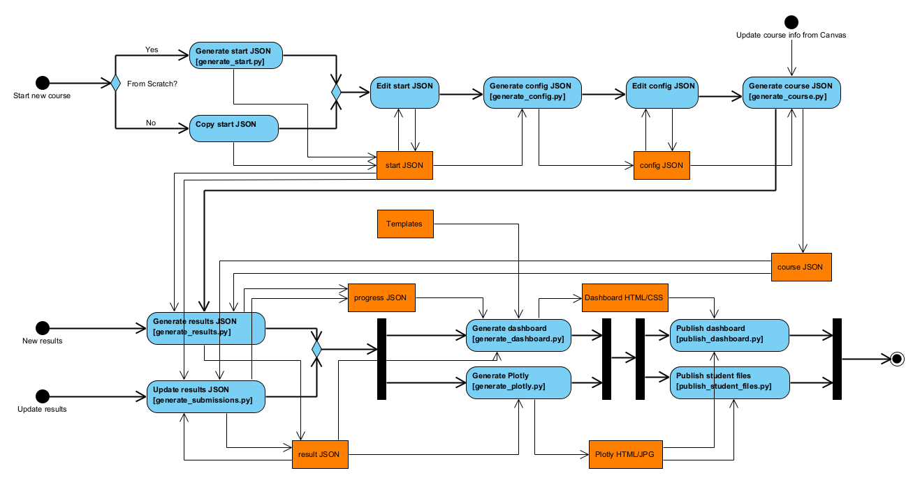

# canvas_dashboard
# Inleiding
Deze Python modules genereren een set van statische html-pagina's op basis van gegevens uit Canvas. De basis zijn de Canvas opdrachten (Assignments).
# De workflow
Er wordt gebruik gemaakt van verschillende stappen om dat het dashboard te komen.

## Stap 1
## Stap 2
Om een nieuwe course omgeving te maken:
- run het Python script `generate_start.py`

Hier worden attributen in JSON formaat opgegeven:
```json 
{
  "api_key": "api_key from Canvas",
  "course_id": 39872,
  "projects_groep_name": "Project Groups",
  "slb_groep_name": "SLB Groep",
  "peil_perspective": "peil",
  "config_file_name": "config_sep23.json",
  "course_file_name": "course_sep23.json",
  "results_file_name": "results_sep23.json",
  "start_date": "2023-09-04T00:00:00Z",
  "end_date": "2024-02-02T23:59:59Z",
  "perspectives": [
    {
      "name": "team",
    },
    {
      "name": "gilde",
    },
    {
      "name": "kennis",
    },
    {
      "name": "peil",
    }
  ],
  "roles": [
    {
      "short": "BIM",
      "name": "Business Analist",
      "btn_color": "btn-success",
      "assignment_groups": []
    },
    {
      "short": "CSC-C",
      "name": "Cloud",
      "btn_color": "btn-danger",
      "assignment_groups": []
    },
    {
      "short": "SD_B",
      "name": "Back-end developer",
      "btn_color": "btn-dark",
      "assignment_groups": []
    },
    {
      "short": "TI",
      "name": "Embedded - Engineer",
      "btn_color": "btn-info",
      "assignment_groups": []
    }
  ]
}
```
## Stap 2
Door het uitvoeren van het Python script `generate_config.py`. De Canvas API wordt aangeroepen om de structuur van Canvas uit te lezen.
- Canvas secties (Sections)
- Opdrachtgroepen (AssignmentGroups)
- Projectgroepen 
- Docenten (Users)
Verder worden de attributen aangemaakt (gekopieerd uit `start.json`):
- Perspectiven
- Rollen
Dit bestand is ook weer een JSON-bestand met de naam `config_file_name` uit `start.json`
## Stap 3
Het `config_file_name` bestand moet verrijkt worden met extra gegevens en logica.
### Secties
- Verwijder de niet relevante `secties`.
- Verrijk een sectie met de `role`, dit is de short name van de `role` uit de `roles` lijst in deze json.
### Perspectives
- Verwijder de niet relevante `perspectives`.
- `assignment_groups` hebben een `id` vanuit Canvas meegekregen, deze worden in de lijst toegevoegd per `perspective`.
### Roles
- Verwijder de niet relevante `roles`.
Het id van de `assignment_groups` binnen de rollen vullen:
```
    {
      "short": "AI",
      "name": "AI - Engineer",
      "btn_color": "btn-warning",
      "assignment_groups": [62149]
    },
```
### Teachers
- Verwijder de niet relevante `teachers`.
Hier worden de `projects` en `assignment_groups` aan de `teachers` gekoppeld. 
- `projects` hebben een `id` vanuit Canvas meegekregen, deze worden in de lijst toegevoegd per `teacher`.
- `assignment_groups` hebben ook een `id` vanuit Canvas meegekregen, deze worden in de lijst toegevoegd per `teacher`.
### AssignmentGroups
- Verwijder de niet relevante `assignment_groups`.
- controlleer de `total_points`
- vul de `lower_points` en de `upper_points` voor de bandbreedte (onder niveau en boven niveau)
  `teachers`, `roles` en `assignments` wordt later automatisch gevuld, 
## Stap 4
Door het uitvoeren van het Python script `generate_course.py` wordt de json bestand `course_file_name` gemaakt. De configuratie voor de `course` is nu klaar. Wanneer de structuur van studenten en assigments niet wijzigd kunnen bij een snapshot stap 1 tm 4 overgeslagen worden.
## Stap 5
De volgende stap is de resultaten/submissions uitlezen uit Canvas. Er wordt intensief gebruik gemaakt van de Canvas-API. Hier zijn twee varianten beschikbaar:
- `generate_results.py`
- `generate_submissions.py`
## Stap 6
Genereer de visuals:
- `generate_plotly.py`
- `generate_dashboard.py`
